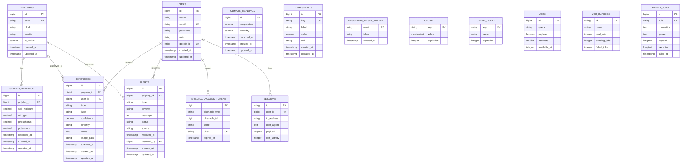

# ERD Berry Care

```mermaid
erDiagram
    USERS {
        bigint id PK
        string name
        string email UK
        string password
        string role
        string google_id UK
        timestamp created_at
        timestamp updated_at
    }
    POLYBAGS {
        bigint id PK
        string code UK
        string block
        string location
        boolean is_active
        timestamp created_at
        timestamp updated_at
    }
    SENSOR_READINGS {
        bigint id PK
        bigint polybag_id FK
        decimal soil_moisture
        decimal nitrogen
        decimal phosphorus
        decimal potassium
        timestamp recorded_at
        timestamp created_at
        timestamp updated_at
    }
    CLIMATE_READINGS {
        bigint id PK
        decimal temperature
        decimal humidity
        timestamp recorded_at
        timestamp created_at
        timestamp updated_at
    }
    DIAGNOSES {
        bigint id PK
        bigint polybag_id FK
        bigint user_id FK
        string type
        string label
        decimal confidence
        string severity
        text notes
        string image_path
        timestamp scanned_at
        timestamp created_at
        timestamp updated_at
    }
    ALERTS {
        bigint id PK
        bigint polybag_id FK
        string type
        string severity
        text message
        string status
        string source
        timestamp resolved_at
        bigint resolved_by FK
        timestamp created_at
        timestamp updated_at
    }
    THRESHOLDS {
        bigint id PK
        string key UK
        string label
        decimal value
        string unit
        timestamp created_at
        timestamp updated_at
    }
    PERSONAL_ACCESS_TOKENS {
        bigint id PK
        string tokenable_type
        bigint tokenable_id
        string name
        string token UK
        timestamp expires_at
    }
    PASSWORD_RESET_TOKENS {
        string email PK
        string token
        timestamp created_at
    }
    SESSIONS {
        string id PK
        bigint user_id FK
        string ip_address
        text user_agent
        longtext payload
        integer last_activity
    }
    CACHE {
        string key PK
        mediumtext value
        integer expiration
    }
    CACHE_LOCKS {
        string key PK
        string owner
        integer expiration
    }
    JOBS {
        bigint id PK
        string queue
        longtext payload
        smallint attempts
        integer available_at
    }
    JOB_BATCHES {
        string id PK
        string name
        integer total_jobs
        integer pending_jobs
        integer failed_jobs
    }
    FAILED_JOBS {
        bigint id PK
        string uuid UK
        text connection
        text queue
        longtext payload
        longtext exception
        timestamp failed_at
    }

    POLYBAGS ||--o{ SENSOR_READINGS : has
    POLYBAGS o|--o{ DIAGNOSES : observed_at
    USERS ||--o{ DIAGNOSES : records
    POLYBAGS o|--o{ ALERTS : concerns
    USERS o|--o{ ALERTS : resolves
    USERS ||--o{ PERSONAL_ACCESS_TOKENS : owns
    USERS o|--o{ SESSIONS : has
```

Tabel `users` dan `personal_access_tokens` sudah dipakai autentikasi.
Tabel domain ditambahkan melalui migrasi tanpa membangun ulang data akun.
